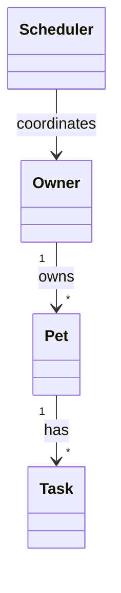

# PawPal+ (Module 2 Project)

You are building **PawPal+**, a Streamlit app that helps a pet owner plan care tasks for their pet.

## Scenario

A busy pet owner needs help staying consistent with pet care. They want an assistant that can:

- Track pet care tasks (walks, feeding, meds, enrichment, grooming, etc.)
- Consider constraints (time available, priority, owner preferences)
- Produce a daily plan and explain why it chose that plan

Your job is to design the system first (UML), then implement the logic in Python, then connect it to the Streamlit UI.

## What you will build

Your final app should:

- Let a user enter basic owner + pet info
- Let a user add/edit tasks (duration + priority at minimum)
- Generate a daily schedule/plan based on constraints and priorities
- Display the plan clearly (and ideally explain the reasoning)
- Include tests for the most important scheduling behaviors

## Features

- **Owner, Pet, and Task models** — Dataclass-based domain objects with clear relationships (`Owner` has many `Pet`s; each `Pet` has many `Task`s).
- **Scheduler** — Collects tasks across pets, **sorts by date and time** (HH:MM), **filters** by completion or pet name, and **detects conflicts** when two or more tasks share the same date and start time.
- **Recurring tasks** — Marking a **daily** or **weekly** task complete creates the next occurrence (next day or next week) automatically.
- **Streamlit UI** — Persists the `Owner` in `st.session_state`, supports adding pets and tasks, shows a sorted table, conflict warnings, and marking tasks complete.

## Smarter Scheduling

The `Scheduler` class in `pawpal_system.py` provides:

- **`sort_by_time()`** — Orders tasks by `task_date` then clock time using a stable sort key (parses `"HH:MM"`).
- **`filter_by_completion()` / `filter_by_pet_name()`** — Narrows the task list for views or reporting.
- **`detect_conflicts()`** — Groups tasks by `(date, time_str)` and emits human-readable warnings when multiple tasks start at the same instant (any pets). This is intentionally lightweight: it flags **exact time matches** only, not overlapping durations.
- **`mark_task_complete()`** — Sets completion; for `daily` / `weekly` tasks, appends a new `Task` for the next occurrence via `timedelta`.

## Architecture (UML)

Mermaid source lives in `uml_diagram.mmd`. A rendered diagram is saved as **`uml_final.png`** in the repo root.



## Testing PawPal+

Run the automated suite from the project root:

```bash
python -m pytest
```

Tests cover: task completion, adding tasks to a pet, **chronological sorting**, **daily recurrence** after complete, **conflict detection** for duplicate start times, and error handling when a task does not belong to a pet.

**Confidence level:** ★★★★☆ (4/5) — Core paths and the listed edge cases are covered; further work could add tests for weekly recurrence, invalid `HH:MM` input, and UI-driven flows.

## 📸 Demo

Replace the image path with your own screenshot after you run the app.

<a href="/course_images/ai110/your_screenshot_name.png" target="_blank"></a>

Local run:

```bash
streamlit run app.py
```

## Getting started

### Setup

```bash
python -m venv .venv
.venv\Scripts\activate
pip install -r requirements.txt
```

### Suggested workflow

1. Read the scenario carefully and identify requirements and edge cases.
2. Draft a UML diagram (see `uml_diagram.mmd` / `uml_final.png`).
3. Convert UML into Python class stubs, then implement scheduling behavior in `pawpal_system.py`.
4. Try the CLI demo: `python main.py`
5. Add tests: `python -m pytest`
6. Connect your logic to the Streamlit UI in `app.py`.
7. Refine UML so it matches what you actually built.
